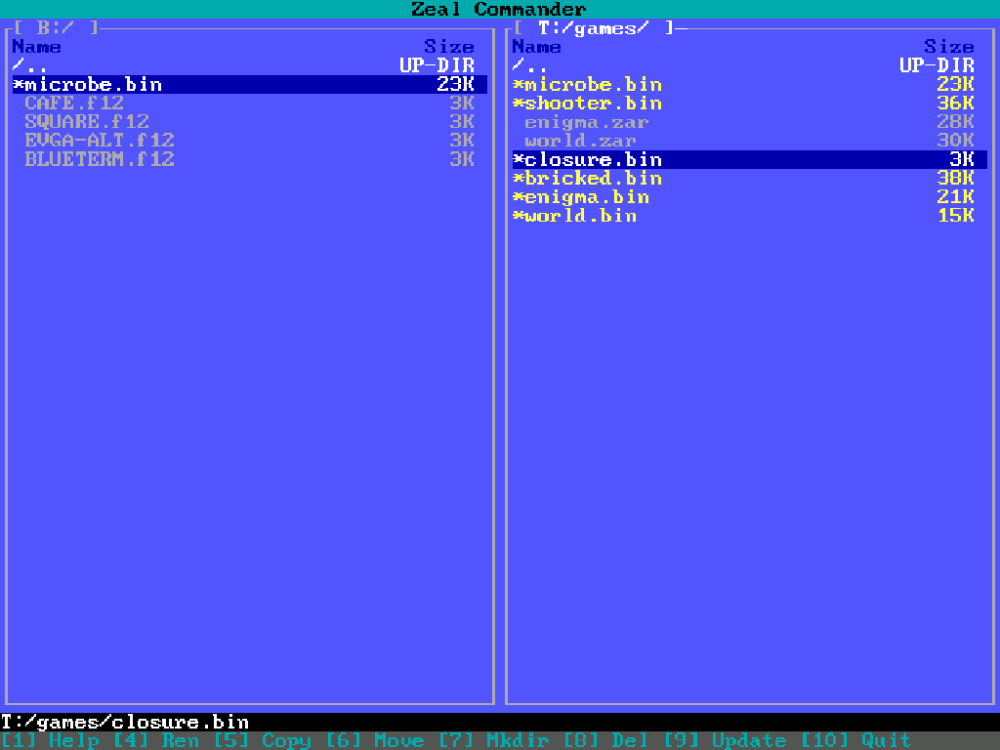
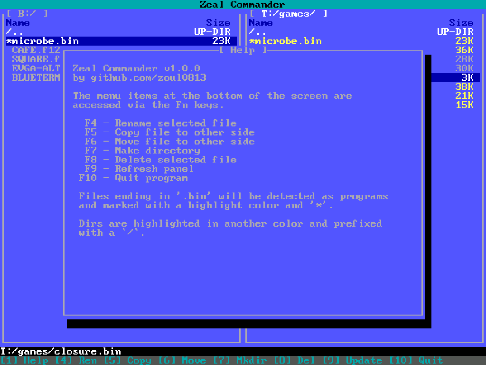
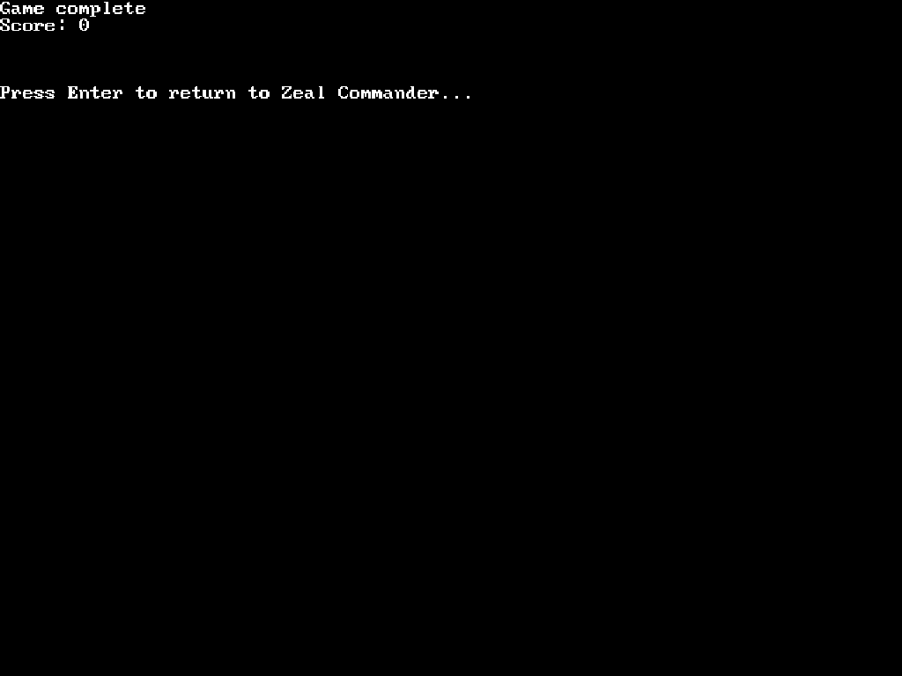
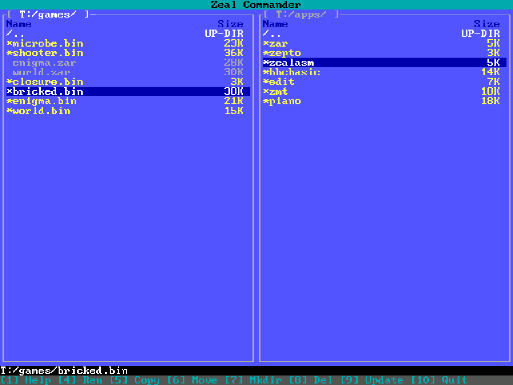
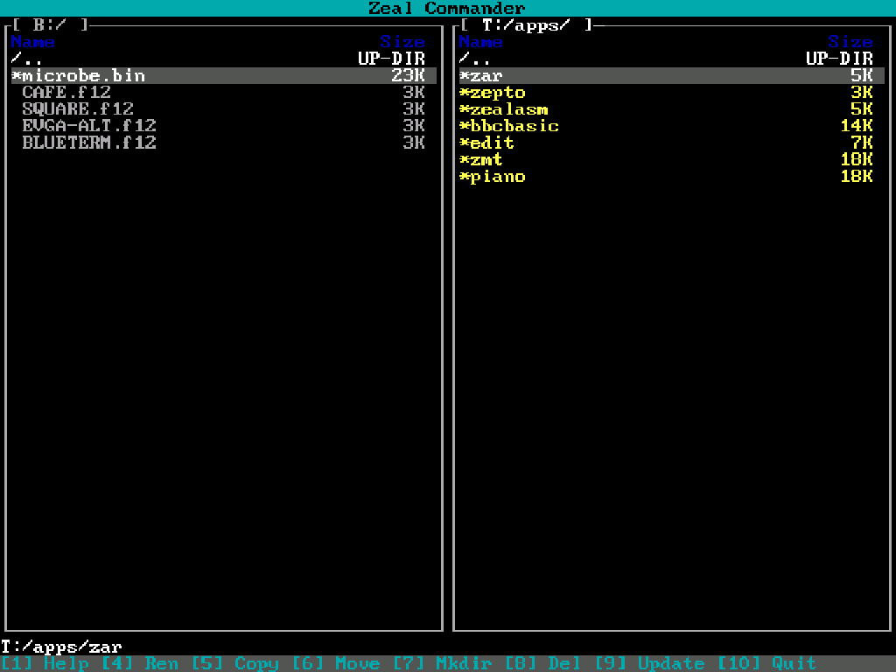
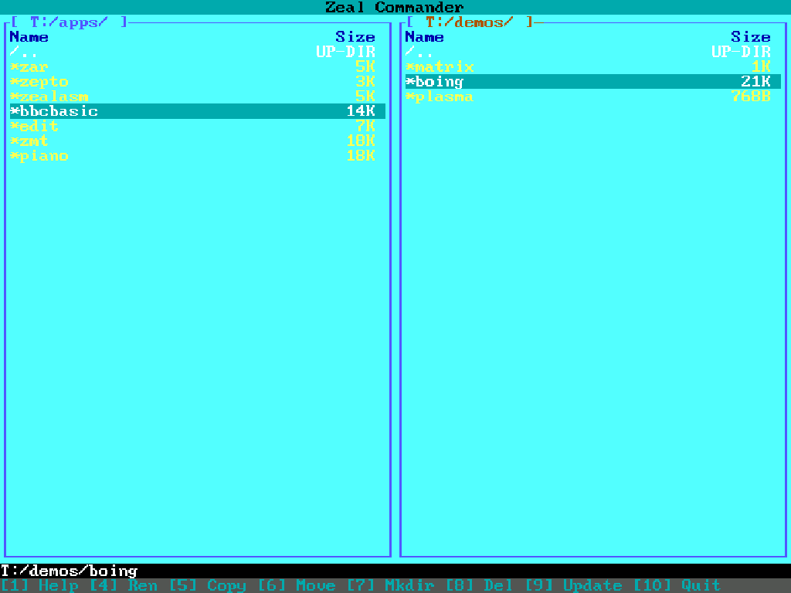

# Zeal Commander

Zeal Commander (or `zc`) is a visual file manager.
It is heavily inspired by [Midnight Commander](https://midnight-commander.org/).

Zeal Commander is a full-screen, text-mode program that allows you
to copy, move, and delete files and entire directory trees, search for files, and execute programs.



> [!WARNING]
> Zeal Commander reads and writes data to all of your mounted disk devices.

## Features

* Rename - Rename files or directories
* Copy - Copy files
* Move - Move Files
* Make Directory - Make new directories
* Delete - Delete files or directories
* Execute - Execute programs
* Change Font - Load custom fonts
* Theming - You can recompile with a custom theme

Zeal Commander supports directories with up to 255 entries.
If your directory contains more than 255 entries, the remaining entries will not be listed.

> [!NOTE]
> Execute is enabled for files that do not have an extension, or end in `.bin`

> [!NOTE]
> Change font works with `.f12` files, commonly used for DOS Fonts with an 8x12 font layout.
> Refer to [Memory Mapping](https://zeal8bit.com/getting-started-zvb/#memory-mapping-5)
> for [Zeal Video Board](https://zeal8bit.com/getting-started-zvb/) on the exact format of fonts.

> [!NOTE]
> Theming is currently only supported by recompiling a custom binary.
> Three themes are provided in the current source, `THEME_DEFAULT`, `THEME_DARK` and `THEME_BRIGHT`

## Screenshots

__The inline help dialog__


__The screen displayed after execution of a program__


## Theming

Zeal Commander supports Theming by defining custom constants in `theme.h`.

### Theme Examples

__Default Theme__


__Dark Theme__


__Bright Theme__


### Theme Constants

You can define custom themes, by adding the following constants to `theme.h`

The `TEXT_COLOR_*` constants are from [zos_video.asm](https://github.com/Zeal8bit/Zeal-8-bit-OS/blob/main/kernel_headers/z88dk-z80asm/zos_video.asm) or [zos_video.h](https://github.com/Zeal8bit/Zeal-8-bit-OS/blob/main/kernel_headers/sdcc/include/zos_video.h)

```c
/** DEFAULT THEME */
#ifdef THEME_DEFAULT
#define FG_PRIMARY              TEXT_COLOR_LIGHT_GRAY
#define FG_PRIMARY_HIGHLIGHT    TEXT_COLOR_WHITE
#define BG_PRIMARY              TEXT_COLOR_DARK_BLUE
#define BORDER_PRIMARY          TEXT_COLOR_WHITE

#define FG_FOLDER               TEXT_COLOR_WHITE
#define FG_EXEC                 TEXT_COLOR_YELLOW
#define FG_HEADING              TEXT_COLOR_DARK_BLUE
#define FG_ERROR                TEXT_COLOR_DARK_RED

#define FG_SECONDARY            TEXT_COLOR_LIGHT_GRAY
#define FG_SECONDARY_HIGHLIGHT  TEXT_COLOR_WHITE
#define BG_SECONDARY            TEXT_COLOR_BLUE
#define BORDER_SECONDARY        TEXT_COLOR_LIGHT_GRAY

#define FG_MENU                 TEXT_COLOR_DARK_CYAN
#define BG_MENU                 TEXT_COLOR_BLACK

#define FG_MESSAGE              TEXT_COLOR_WHITE
#define BG_MESSAGE              TEXT_COLOR_BLACK
#endif
```

Additional theming can be performed on the characters used to generate the UI, these include the following


```c
#define CH_NEWLINE          0x0A // New line
#define CH_SPACE            0x20 // Space
#define CH_TAB              0x09 // Tab
#define CH_ULCORNER         0xDA // Top Left
#define CH_URCORNER         0xBF // Top Right
#define CH_LLCORNER         0xC0 // Bottom Left
#define CH_LRCORNER         0xD9 // Bottom Right
#define CH_HLINE            0xC4 // Horizonal line
#define CH_VLINE            0xB3 // Vertical line
#define CH_DOT              0xF9 // Vertically Centered "Dot"
#define CH_BRACKET_LEFT     '[' // The `[` symbol
#define CH_BRACKET_RIGHT    ']' // The `]` symbol
```

These constants are used to render the various panel borders, driven by `windows.h`.

## TODO

- [ ] Sorting
- [ ] Bulk Copy/Delete (ie; directories)
- [ ] Tree View

## Installation

Use `xfer.py` to transfer `zc.bin` to your Zeal 8-bit Computer.

```shell
xfer.py -s -v -f bin/zc.bin
```

## Building from source

Make sure that you have [ZDE](https://github.com/zoul0813/zeal-dev-environment) installed.

Then open a terminal, go to the source directory and type the following commands:

```shell
zde restart
zde make
```
